# Student Management - Advanced Software Engineering (HCMUT)

**HCMC University of Technology (HCMUT)**  
**Faculty of Computer Science and Engineering**  
**Advanced Software Engineering**  
**Lab Series:** Xây Dựng Web App Căn Bản (Lab 1 → Lab 5)

---

## 1) Thông tin nhóm

- **Thành viên 1:** Lê Hoàng Luân — **MSSV:** `2311982`

---

## 2) Public URL (Deployment)

- **Public URL (Render):** `https://hcmut-ase-student-management-2.onrender.com`
- **Live Demo:** `https://hcmut-ase-student-management-2.onrender.com/students/list`
---

## 3) Công nghệ sử dụng

- Java 17+
- Spring Boot
- Maven Wrapper (`./mvnw`)
- Thymeleaf
- Database: SQLite / PostgreSQL
- Docker / Docker Compose

---

## 4) Cấu trúc chức năng đã hoàn thành

- Khởi tạo project + cấu hình DB
- CRUD backend (service/repository)
- Thymeleaf hiển thị danh sách
- CRUD Web UI hoàn chỉnh + PostgreSQL
- Docker & Deployment (Render + Neon)

---

## 5) Route Web SSR (khớp code hiện tại)

- **Base path:** `/students`

- `GET /students` (có thể kèm `?keyword=...`)
- `GET /students/list` (có thể kèm `?keyword=...`)
- `GET /students/{id}`
- `GET /students/new`
- `POST /students`
- `GET /students/{id}/edit`
- `POST /students/{id}`
- `POST /students/{id}/delete`

---

## 6) Hướng dẫn chạy dự án

### 6.1 Yêu cầu môi trường

- Cài JDK 17+
- Hoặc Docker Desktop nếu chạy bằng Docker/Compose

### 6.2 Chạy bằng Maven Wrapper

**Bước 1:** vào thư mục project

```bash
cd student-management
```

**Bước 2:** chạy ứng dụng

```bash
./mvnw spring-boot:run
```

**Bước 3:** truy cập

- `http://localhost:8080/students`
- `http://localhost:8080/students/list`

---

## 7) Cấu hình Database (PostgreSQL)

Dự án đọc cấu hình từ biến môi trường:

- `PORT` (mặc định 8080)
- `DATABASE_URL`
- `DB_USERNAME`
- `DB_PASSWORD`

### 7.1 Chạy local với PostgreSQL

Tạo file `.env` (**KHÔNG commit lên git**):

```env
PORT=8080
DB_USERNAME=<YOUR_DB_USERNAME>
DB_PASSWORD=<YOUR_DB_PASSWORD>
DATABASE_URL=jdbc:postgresql://localhost:5432/student_management
```

Chạy:

```bash
export PORT=8080
export DB_USERNAME="<YOUR_DB_USERNAME>"
export DB_PASSWORD="<YOUR_DB_PASSWORD>"
export DATABASE_URL="jdbc:postgresql://localhost:5432/student_management"

./mvnw spring-boot:run
```

---

## 8) Chạy bằng Docker / Docker Compose

### 8.1 Build & run bằng Dockerfile

```bash
docker build -t student-management:latest .
docker run -p 8080:8080 student-management:latest
```

### 8.2 Run bằng Docker Compose
```bash
docker compose up --build
```

Truy cập :

- `http://localhost:8080/students/list`

---

## 9) Ghi chú cấu hình JPA

```properties
spring.jpa.hibernate.ddl-auto=update
spring.jpa.show-sql=true
```

## Lab 1 — Câu hỏi lý thuyết
### Câu 1 - Thêm 10 dữ liệu
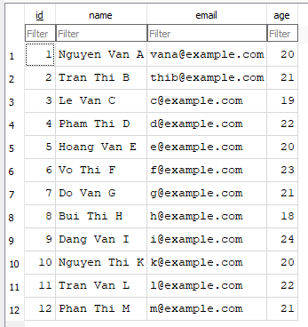

### Câu 2 — Ràng buộc Khóa Chính 
**Hiện tượng quan sát:** Khi cố tình chèn một sinh viên có `id` trùng với `id` đã tồn tại, SQLite báo lỗi dạng `UNIQUE constraint failed: students.id`.

**Giải thích:**  
Trong mô hình quan hệ, **Primary Key** là thuộc tính dùng để **định danh duy nhất** mỗi bản ghi trong bảng. Vì vậy:
- Mỗi giá trị PK phải **duy nhất** (unique) và **không được NULL**.
- PK là cơ sở để các thao tác cập nhật/xóa/tra cứu định danh chính xác một dòng dữ liệu.
- Nếu cho phép trùng PK thì sẽ phát sinh mâu thuẫn định danh (không thể xác định “bản ghi nào” là đúng), đồng thời phá vỡ tính đúng đắn của quan hệ (đặc biệt khi bảng khác tham chiếu bằng Foreign Key).

Do đó, DBMS áp ràng buộc **toàn vẹn thực thể** và **từ chối** thao tác insert trùng khóa.

---

### Câu 3 — Toàn vẹn dữ liệu (Constraints) với trường `name` có thể NULL
**Hiện tượng quan sát:** Nếu cột `name` không được khai báo `NOT NULL`, cơ sở dữ liệu **có thể** cho phép chèn bản ghi với `name = NULL` (tùy theo schema hiện tại). Khi đó DB **không báo lỗi** vì không có ràng buộc ngăn chặn.

**Ảnh hưởng khi code Java đọc dữ liệu lên:**
- **Sai nghiệp vụ:** “sinh viên không có tên” thường không hợp lệ trong bài toán quản lý sinh viên.
- **Rủi ro lỗi runtime:** nhiều xử lý chuỗi trong Java (ví dụ `trim()`, `length()`, ghép chuỗi, validate…) có thể gây **NullPointerException** nếu không kiểm tra null.
- **Chất lượng dữ liệu giảm:** dữ liệu thiếu/khuyết gây khó khăn cho tìm kiếm, sắp xếp, hiển thị UI, thống kê, hoặc đồng bộ hệ thống khác.
- **Tăng chi phí kiểm tra ở tầng ứng dụng:** nếu DB không enforce ràng buộc, lập trình viên phải bù bằng validate ở Service/Controller; dễ sót và tạo “data bẩn” lâu dài.

**Kết luận:** Ràng buộc dữ liệu nên được thiết kế **ở cả hai phía**:
- DB enforce các ràng buộc nền tảng (ví dụ `NOT NULL` cho `name`, `CHECK(age > 0)`, `UNIQUE(email)` nếu cần),
- Ứng dụng (Service layer) validate theo nghiệp vụ và trả lỗi thân thiện cho client.

---

### Câu 4 — Cấu hình Hibernate: Vì sao chạy lại ứng dụng thì dữ liệu bị mất?
**Nguyên nhân:** Do cấu hình:
- `spring.jpa.hibernate.ddl-auto=create`

Trong Hibernate/JPA, `ddl-auto=create` có nghĩa:
- Mỗi lần ứng dụng khởi động, Hibernate sẽ **tạo lại schema từ đầu** theo Entity.
- Thực tế thường bao gồm việc **xóa cấu trúc cũ** (drop) và **tạo mới** (create), khiến dữ liệu đã có trong các bảng bị mất.

**Ý nghĩa & bối cảnh sử dụng:**
- `create` phù hợp giai đoạn học/làm nhanh để đảm bảo schema luôn “đúng theo Entity” và dễ reset môi trường.
- Không phù hợp môi trường có dữ liệu thật.

**Hướng xử lý để không mất dữ liệu khi restart:**
- Dùng `ddl-auto=update` để Hibernate cố gắng cập nhật schema mà **giữ dữ liệu** (thường dùng cho môi trường dev).
- Hoặc `ddl-auto=validate/none` cho môi trường production.

**Kết luận:** Dữ liệu bị mất là hành vi đúng theo thiết kế của `ddl-auto=create`; muốn bảo toàn dữ liệu cần chọn chế độ phù hợp hơn.

## Lab 2 — Kết quả kiểm thử 
| url | ok | status_code | content_type | raw_body | json | error |
| --- | --- | ----------- | ------------ | -------- | ---- | ----- |
| http://localhost:8080/api/students | true | 200 | application/json | "[{\"id\":\"1\",\"name\":\"Nguyen Van A\",\"email\":\"vana@example.com\",\"age\":20},{\"id\":\"2\",\"name\":\"Tran Thi B\",\"email\":\"thib@example.com\",\"age\":21},{\"id\":\"3\",\"name\":\"Le Van C\",\"email\":\"c@example.com\",\"age\":19},{\"id\":\"4\",\"name\":\"Pham Thi D\",\"email\":\"d@example.com\",\"age\":22},{\"id\":\"5\",\"name\":\"Hoang Van E\",\"email\":\"e@example.com\",\"age\":20},{\"id\":\"6\",\"name\":\"Vo Thi F\",\"email\":\"f@example.com\",\"age\":23},{\"id\":\"7\",\"name\":\"Do Van G\",\"email\":\"g@example.com\",\"age\":21},{\"id\":\"8\",\"name\":\"Bui Thi H\",\"email\":\"h@example.com\",\"age\":18},{\"id\":\"9\",\"name\":\"Dang Van I\",\"email\":\"i@example.com\",\"age\":24},{\"id\":\"10\",\"name\":\"Nguyen Thi K\",\"email\":\"k@example.com\",\"age\":20},{\"id\":\"11\",\"name\":\"Tran Van L\",\"email\":\"l@example.com\",\"age\":22},{\"id\":\"12\",\"name\":\"Phan Thi M\",\"email\":\"m@example.com\",\"age\":21}]" | [{"id":"1","name":"Nguyen Van A","email":"vana@example.com","age":20},{"id":"2","name":"Tran Thi B","email":"thib@example.com","age":21},{"id":"3","name":"Le Van C","email":"c@example.com","age":19},{"id":"4","name":"Pham Thi D","email":"d@example.com","age":22},{"id":"5","name":"Hoang Van E","email":"e@example.com","age":20},{"id":"6","name":"Vo Thi F","email":"f@example.com","age":23},{"id":"7","name":"Do Van G","email":"g@example.com","age":21},{"id":"8","name":"Bui Thi H","email":"h@example.com","age":18},{"id":"9","name":"Dang Van I","email":"i@example.com","age":24},{"id":"10","name":"Nguyen Thi K","email":"k@example.com","age":20},{"id":"11","name":"Tran Van L","email":"l@example.com","age":22},{"id":"12","name":"Phan Thi M","email":"m@example.com","age":21}] | null |
| http://localhost:8080/api/students/1 | true | 200 | application/json | "{\"id\":\"1\",\"name\":\"Nguyen Van A\",\"email\":\"vana@example.com\",\"age\":20}" | {"id":"1","name":"Nguyen Van A","email":"vana@example.com","age":20} | null |
| http://localhost:8080/api/students/999 | false | 200 | null | "" | null | Expected 404 Not Found (student not found), but got 200 with empty body |

## Lab 3 — Kết quả hiện thực 
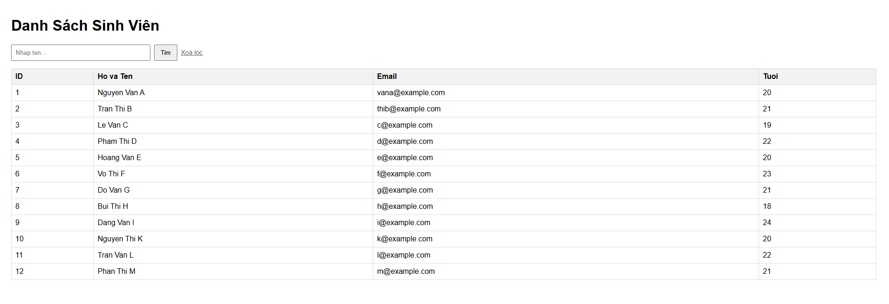

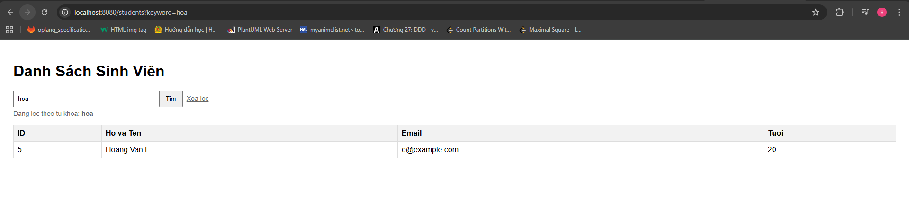

## Lab 4 — Kết quả hiện thực

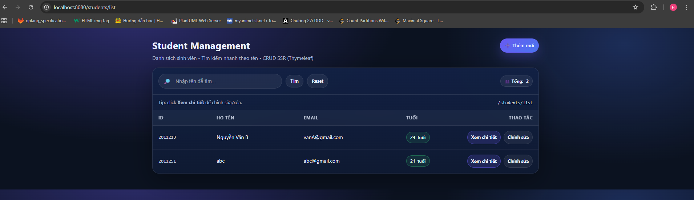
 
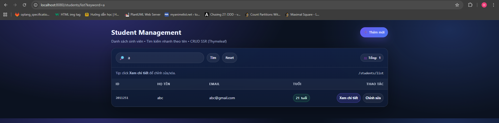

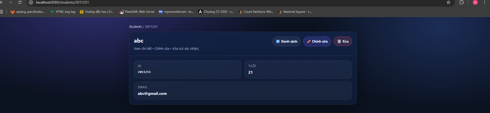

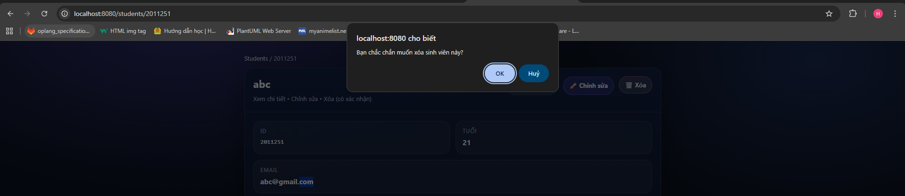

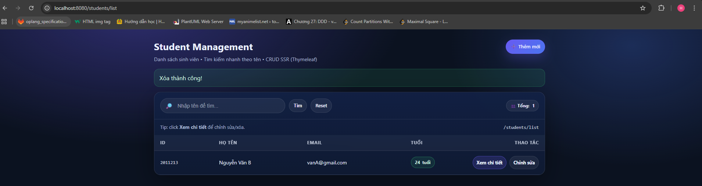

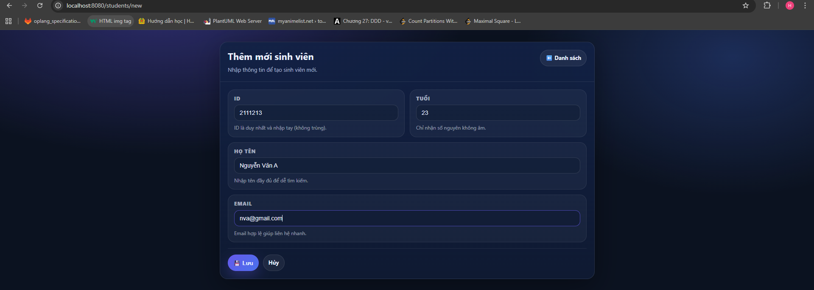

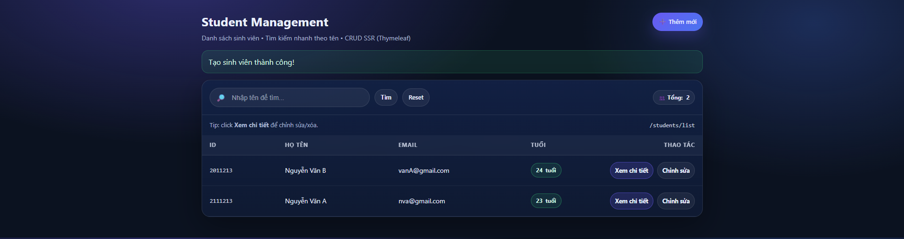

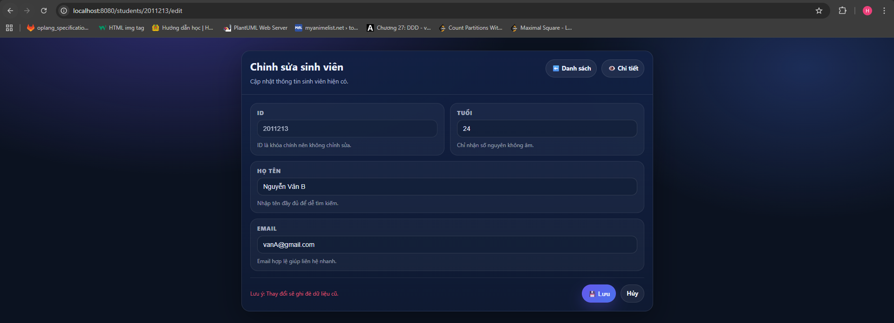

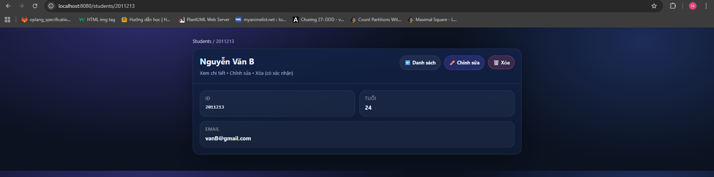

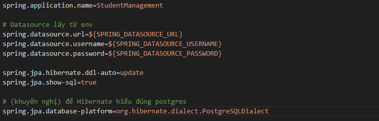

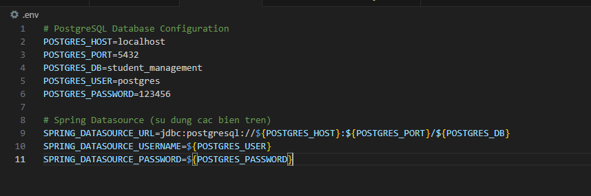

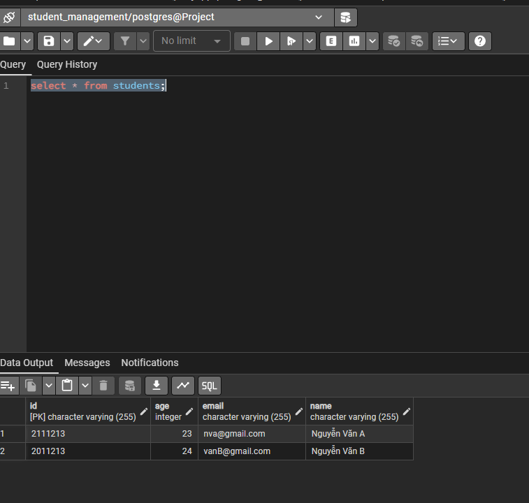

## Lab 5 — Kết quả hiện thực
- **Live Demo:** `https://hcmut-ase-student-management-2.onrender.com/students/list`